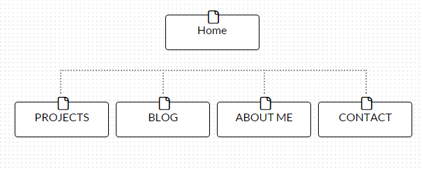

What are the 6 Phases of Web Design?

1. Information Gathering 
2. Planning 
3. Design 
4. Development 
5. Testing/Delivery
6. Maintenance

What is your site's primary goal or purpose? What kind of content will your site feature? 
My site's primary goal is to introduce me to potential employers. It will contain a portfolio of projects, BLOG posts, and contact information. 

What is your target audience's interests and how do you see your site addressing them?
Visitors to my site will have access to my bio and resume, projects, and some personal information. They will be able to view my projects/posts, leave messages, and contact me through the site.

What is the primary "action" the user should take when coming to your site? Do you want them to search for information, contact you, or see your portfolio? It's ok to have several actions at once, or different actions for different kinds of visitors.
My initial thought is that visitors should see a background graphic and my picture on the index page. Links will be provided for specific information (e.g. portfolio, BLOG, etc.) and functions (e.g. contact, leave messages etc.).

What are the main things someone should know about design and user experience?
1. Design is the process of solving a problem for people.
2. User experience is how a person feels when using a system, whether it is software, website, application, etc.
3. Design and user experience should add value to the system you are building.

What is user experience design and why is it valuable? 
User experience design looks to enhance how users interact with a system by examining aspects such as usability, accessibility, interface, efficiency, etc. It is valuable because it addresses user experience across an increasingly diverse universe of web technology/products and ways in which we access websites. In addition, user experience may be a revenue driver for a large system such as e-commerce operations, so user experience design should not neglected.   

Which parts of the challenge did you find tedious? 
The part of the challenge that was most difficult, not necessarily tedious, was thinking about issues such as the purpose, contents, target audience, etc. I decided to start my site with just one purpose and a few pieces of supporting information. However, I can see how the information gathering, planning, and design processes can become very complex very quickly.

<!-- COMMENTs -->