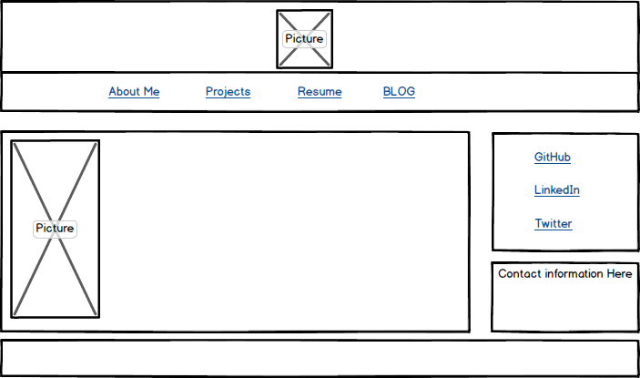
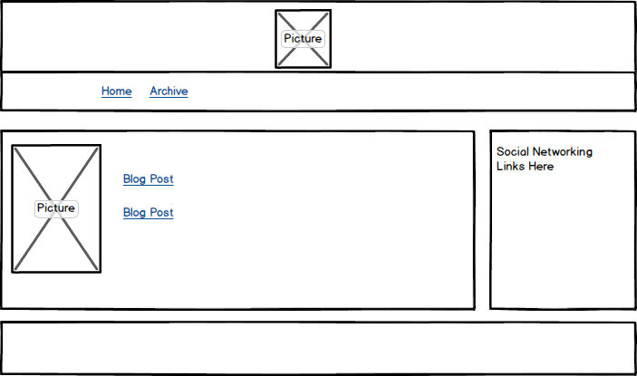

What is a wireframe?
A wireframe is a depiction of the information hierarchy for the design of a website, similar to an architectural blueprint. The wireframe can be used to plan the layout of the website.

What are the benefits of wireframing?
Wireframing allows the designer to visualize the layout without being distracted by colors, fonts, and other external features. It also allows the designer to plan how the user will interact with the website.

Did you enjoy wireframing your site?
I enjoyed wireframing my site as I have never done this before. I was excited about creating my own designs as well as learning about what one can do with wireframes.

Did you revise your wireframe or stick with your first idea?
I revised index.html several times. As a result the other wireframes had to be revised as well. I revised the blog/index.html page slightly since this page is going to contain the links to the blogs rather than the blogs themselves. 

What questions did you ask during this challenge? What resources did you find to help you answer them?
My had questions about what wireframing tools are available to me. I found this site (http://mashable.com/2010/07/15/wireframing-tools/ very helpful). Regarding the role of wireframing in the context of the overall user experience process I found useful information here: (www.smashingmagazine.com/2012/08/beyond-wireframing-real-life-ux-design-process).  

Which parts of the challenge did you enjoy and which parts did you find tedious?
I enjoyed creating visual images of my design and exploring the charastics and qualities of each design. I also enjoyed brainstorming the possibilities for different features I could add to my pages. The part of the challenge that was a little tedious was the making of the wireframes themselves since I did not use a graphic design software at first.