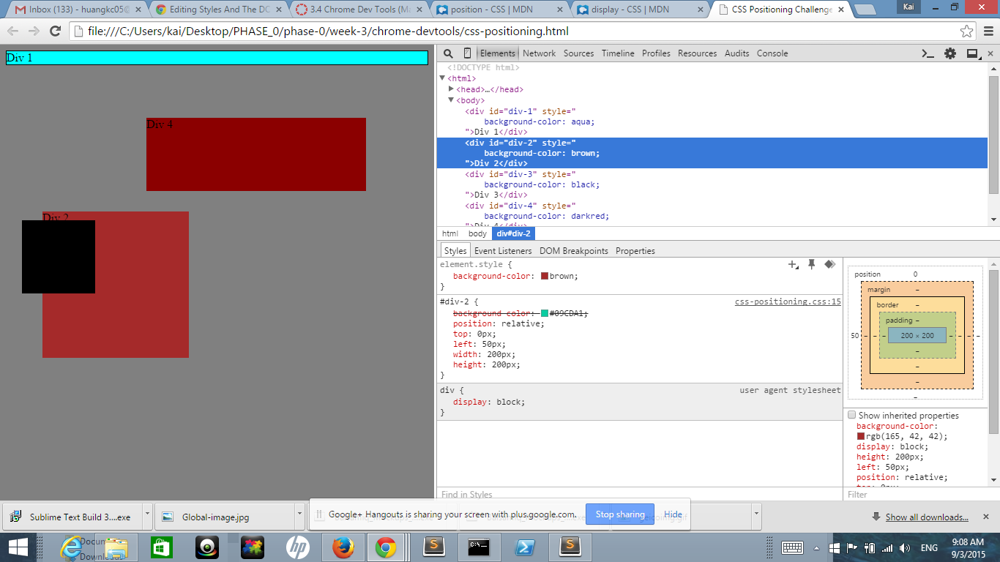
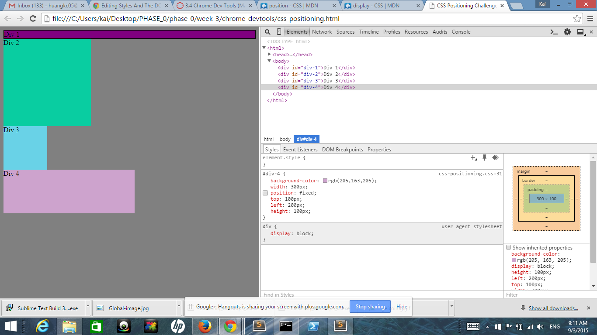
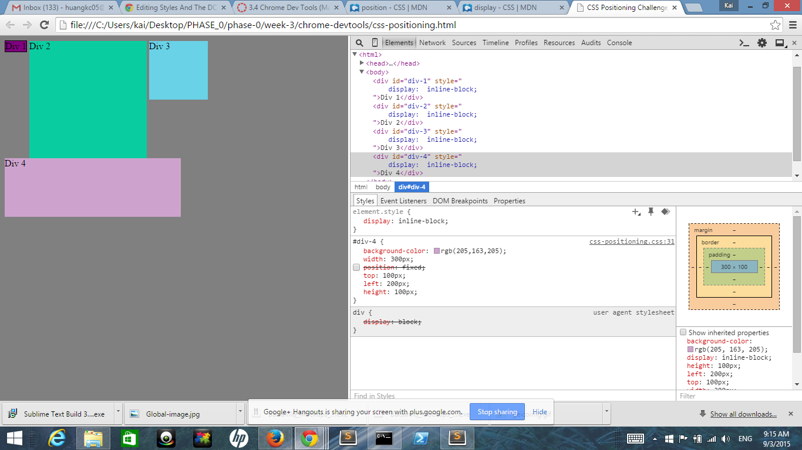
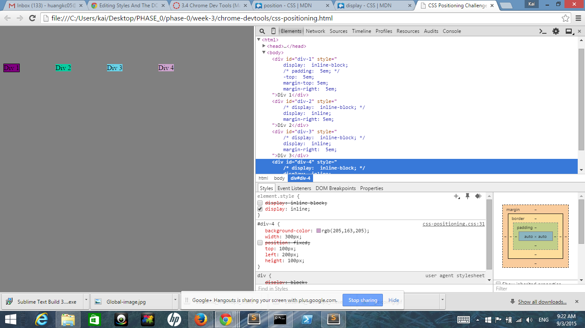
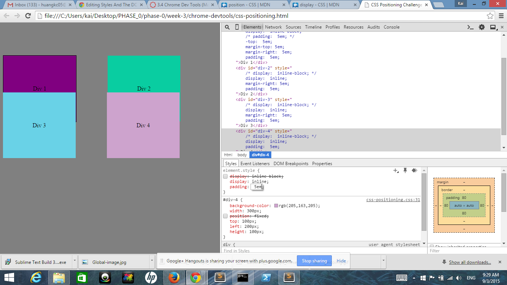
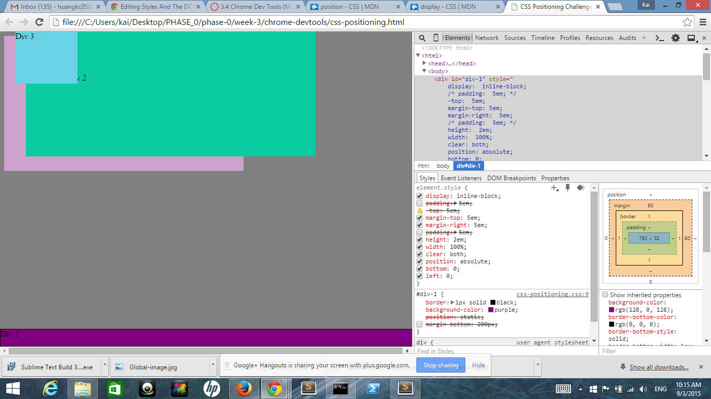
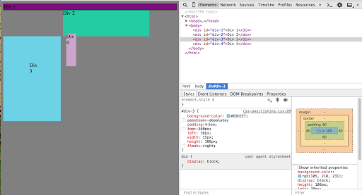
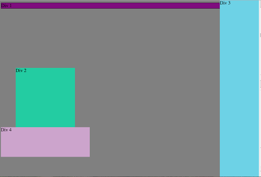
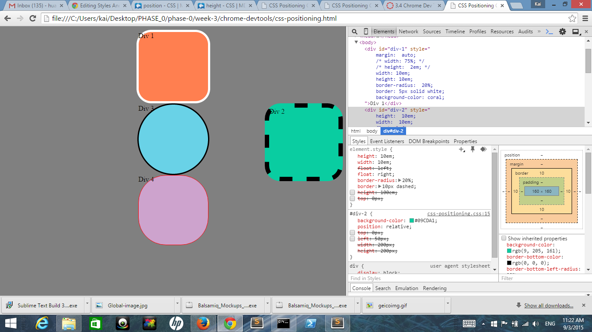

How can you use Chrome's DevTools inspector to help you format or position elements?
The tool shows the tree view of the DOM nodes on the web page. The inspector shows the HTML element and the CSS properties responsible for rendering that element. You can live-edit the CSSS code in Devtool to reformat elements or change their position. 

How can you resize elements on the DOM using CSS?
You can resize elements by changing their width and height.

What are the differences between Absolute, Fixed, Static, and Relative positioning? Which did you find easiest to use? Which was most difficult?
Absolute positioning positions an element relative to the first parent element whose position is not static. Static is the default position and the element is not affected by properties such as top and bottom. Relative is a position relative where an element normally would have been. Fixed  position anchors the element to the screen so the element stays in the same place as the page is scrolled. I did not find any one of them particularly difficult to use. However, when used in combination with multiple elements it was very difficult to keep track of how each affected the outcome.

What are the differences between Margin, Border, and Padding?
Margin is the space between the border of the element and the edge of the screen. Border is the space between the content and the margin. Padding the space between the content and the border.

What was your impression of this challenge overall? (love, hate, and why?) 
This challenge involved a lot of trial and error, which was beneficial as I got to figure things out for myself and validate what I learned. However, it can reach a point of diminishing returns after a while, and sometimes the challenge was frustrating when we weren't able to produce the results or weren't sure why CSS behaved the way it did. I think I underestimated the time commitment for this challenge as it took some practice just to become familiar with DevTools in addition to learning how to manipulate CSS.

Exercise 1: Change the colors

Exercise 2: Column

Exercise 3: Row

Exercise 4: Make equidistant

Exercise 5: Squares

Exercise 6: Footer

Exercise 7: Header

Exercise 8: Sidebar

Exercise 9: Get creative
