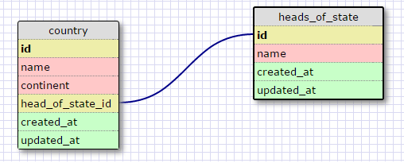
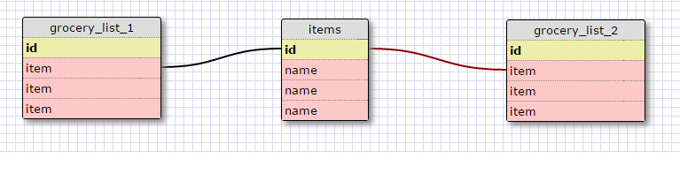

Release 2
One-to-One Database

A country can have at most one head of state and a person can be 
head of state for at most one country.

Release 4
Grocery list

Release 6

What is a one-to-one database?  
A database for things that have a one-to-one relationship.

When would you use a one-to-one database? (Think generally, not in terms of the example you created).
Use a one-to-one relationship if you have a relationship where a group of fields can all optionally be empty.

What is a many-to-many database?
A database for things that can relate to each other in more than one 
way.

When would you use a many-to-many database? (Think generally, not in terms of the example you created).
When objects are related to each other in many different ways or through other
objects.

What is confusing about database schemas? What makes sense?
How to model complex databases is confusing. The way data is organized in rows and
tables makes sense.
